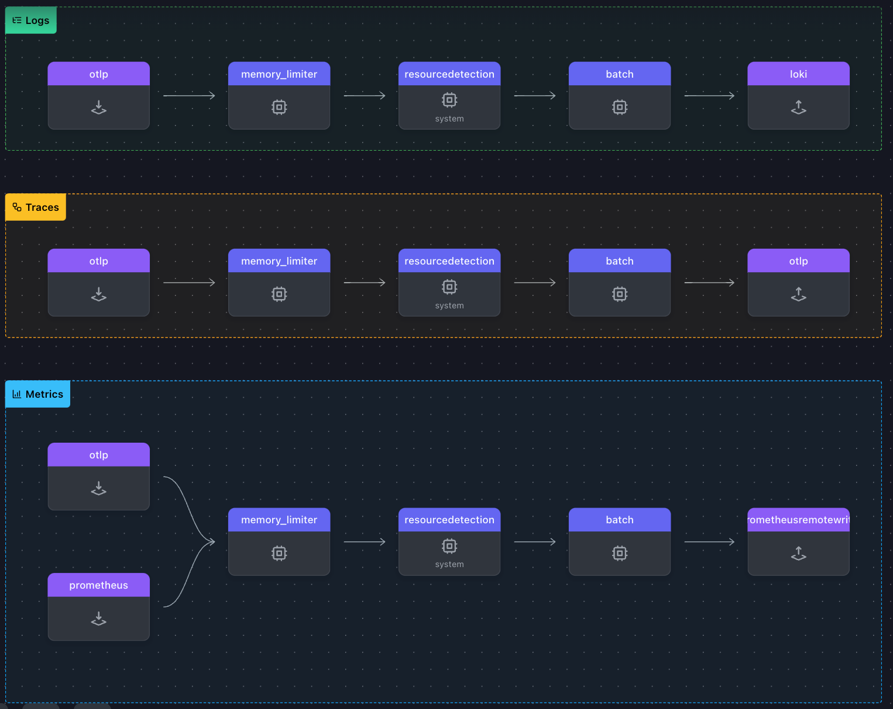

## OpenTelemetry Collector

**Monitoramento**: é a prática de obter resposta rápida para perguntas frequentes.

**Observabilidade**: é a capacidade de achar repostas para perguntas que ainda não temos.

[by Juraci Paixão](https://www.linkedin.com/in/jpkroehling/)

### Telemetria

**Logs**: É um registro de evento relevante e imutável gerado por sistema computacional ao longo do tempo.

**Trace**: Também conhecido como rastreamento, trace ou tracing, possibilita acompanhar o fluxo e a condição de uma transação. 

**Métrica**: É uma representação numérica de uma informação em relação ao tempo.

### Requisitos

- [Docker](https://docs.docker.com/engine/install/)
- [Docker-compose](https://docs.docker.com/compose/install/standalone/)

### Executando 

Execute o seguinte comando no diretório raiz do projeto:

```shell
docker-compose up -d  
```

- Gerando logs: execute o comando para gerar logs e validar o funcionamento do Loki.

```shell
export i=0; while true; do echo "{\"level\":\"info\",\"time\":$(date +%s),\"msg\":\"This is my dummy log number ${i}\"}" >> ./shared/generated-log.log; i=$((i+1));sleep 1;done
```
### Explorando dados

Acesse o console do Grafana Web para explorar as métricas, traces e logs. 

- http://localhost:3000/


> Caso solicite usuário e senha, digite:

- User: admin
- Password: admin

### Referências

[Observabilidade e Monitoramento](https://dev.to/ezziomoreira/observabilidade-e-monitoramento-1p1a)

[Três Pilares da Observabilidade](https://dev.to/ezziomoreira/tres-pilares-da-observabilidade-1p6d)

[Conceitos OpenTelemetry](https://dev.to/ezziomoreira/conceitos-opentelemetry-9k0)

[OpenTelemetry Collector](https://opentelemetry.io/docs/collector/)

[OpenTelemetry Collector Contrib](https://github.com/open-telemetry/opentelemetry-collector-contrib)

[Visualização Gráfica das Configurações do Collector](https://www.otelbin.io/)

### Representação Gráfica das configurações do Collector


